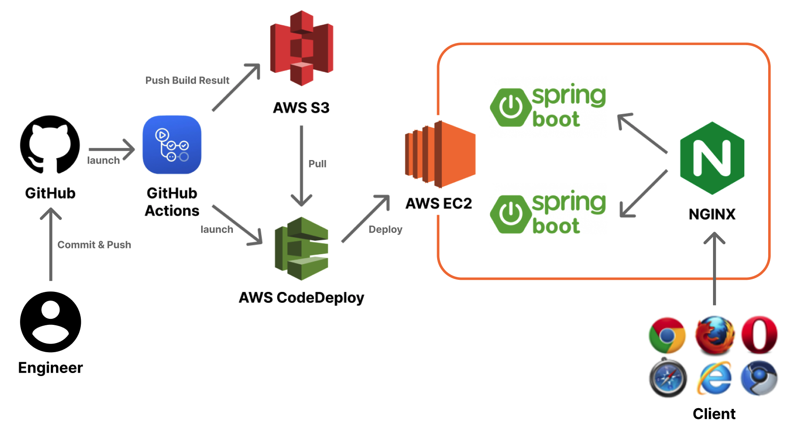
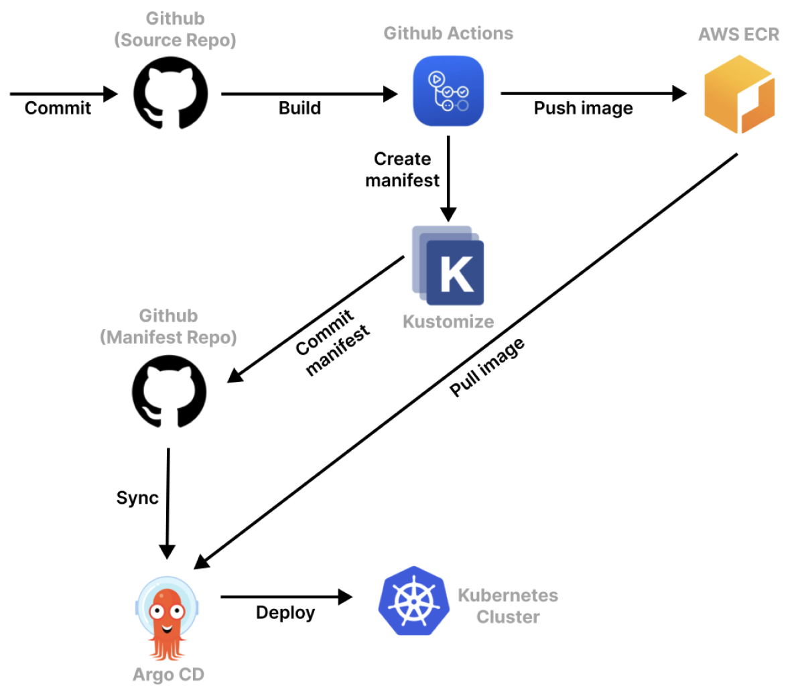

# Heart to Heart API Server
이 프로젝트는 SNS 애플리케이션인 `Heart to Heart`를 위한 API 서버입니다. `Heart to Heart` 안드로이드 어플리케이션은 [이 곳](https://github.com/yologger/heart-to-heart-android)에서 확인할 수 있습니다.

## 기능 구현
- [x] 이메일 인증 (`Spring Email`)
- [x] 회원 가입
- [x] 토큰 기반 로그인 구현 및 권한 부여 (`JWT`, `Spring Security`)
- [x] 토큰 갱신 구현
- [x] 로그아웃 구현
- [x] 회원 탈퇴 구현 
- [x] 아바타 이미지 업로드 (`AWS S3`)
- [x] 사용자 차단 및 해제 구현 (`Spring Data JPA`)
- [x] 사용자 신고 구현
- [x] API 입력값 인증 구현 (`Spring Validation`)
- [x] 게시글 작성 및 이미지 업로드 구현
- [x] 게시글 조회 및 페이징 구현 (`Query DSL`)
- [x] 게시글 삭제 구현
- [x] `ControllerAdvice`를 통한 에러 처리 구현
- [x] `JUnit 5`, `Truth`, `Assertion`, `Mockito`, `H2`를 사용한 단위테스트, 통합테스트 구현
- [x] `Swagger 2`를 사용한 문서화
- [x] 테스트 환경 구축
  - [x] ~~Heroku, Jaws DB(MySQL)을 통한 테스트 환경 구축~~ (Deprecated)
  - [x] AWS EC2, S3, RDS으로 테스트 환경 마이그레이션
  - [x] Git/GitHub, GitHub Actions, AWS CodeDeploy, S3를 통한 CI/CD 구축
  - [x] Nginx를 통한 무중단 배포 구축
- [x] 운영 환경 구축
  - [x] Docker, Kubernetes(AWS ELK)를 통한 운영 환경 구축
  - [x] Kustomize, GitHub, AWS ECR, Argo CD를 통한 Pull-based GitOps 구축
  - [x] GitHub Actions, Slack 메시징 연동
  - [x] Git Flow를 통한 깃 브랜치 전략 도입 (master, alpha, develop)
  - [x] Kubernetes Replicset을 통한 스케일 아웃, 셀프 힐링 구축
  - [x] Kubernetes Deployment를 통한 무중단 배포, 롤백 기능 구축
  - [x] Kubernetes Service를 통한 로드 밸런싱 구축

## 기술 스택
- Java 8
- Spring Boot
- Spring MVC
- Spring Data JPA
- Query DSL
- Spring Security
- Spring Validation
- Spring Mail
- Spring Cache
- Lombok
- Spring Test, JUnit 5, Mockito
- Swagger 2
- AWS EC2
- AWS S3
- AWS S3 Mock
- AWS RDS (Maria DB)
- Redis

## TDD

## Auto Scaling

## Infra, DevOps
`Spring Profile`을 사용하여 다음과 같이 환경을 분리하였습니다. 각 환경에서의 인프라는 다음과 같습니다.
- local
- staging
- production

### local
`local` 환경에서는 별도의 데이터베이스 구축 없이도 어플리케이션을 실행할 수 있도록 인메모리 데이터베이스를 사용했습니다.
- H2
- Embedded Redis

### staging
기존에는 `Heroku`를 사용하여 인프라를 구축했습니다.  
- ~~Heroku Serverless Computing~~ (Deprecated)
- ~~Heroku MySQL~~ (Deprecated)

배포 자동화와 로드 밸런싱 구축을 위해서는 Linux 서버를 직접 제어할 필요가 있었습니다. 이 때문에 인프라를 다음과 같은 환경으로 마이그레이션했습니다.
- AWS EC2 
- Nginx

`staging` 환경에서는 다음 기술을 사용하여 CI/CD 자동화를 구축했습니다.
- GitHub Actions
- AWS S3
- AWS CodeDeploy

리버스 프록시 서버로 `Nginx`를 배치하여 무중단 배포를 구축했습니다.

### production
AWS 클라우드 서비스, Terraform, Helm을 사용하여 인프라를 구축했습니다.

부하에 따른 오토 스케일링을 위해 `Kubernetes(AWS EKS, NodeGroup)`를 사용하고 있습니다.
- VPA(Vertical Pod Autoscaling)을 통해 팟을 오토스케일링하고 있습니다.
- K8S Deployment를 사용하여 롤링 업데이트 배포, 롤백을 구축했습니다.

Prometheus, Grafana로 Worker Node의 CPU Utilization, Memory Usage, Network Traffic을 모니터링하고 있습니다.
- Prometheus Stack, Grafana

EFK(Elasticsearch, Fluentbit, Kibana)를 통해 스프링 부트 어플리케이션의 로그 시스템을 구축했습니다.

AWS Elastic Load Balancer(L7), Kubernetes Ingress를 사용하여 로드 밸런싱을 구축했습니다.

GitHub Actions, AWS ECR, Kustomize, Argo CD를 사용하여 CI/CD 자동화를 구축했습니다.

