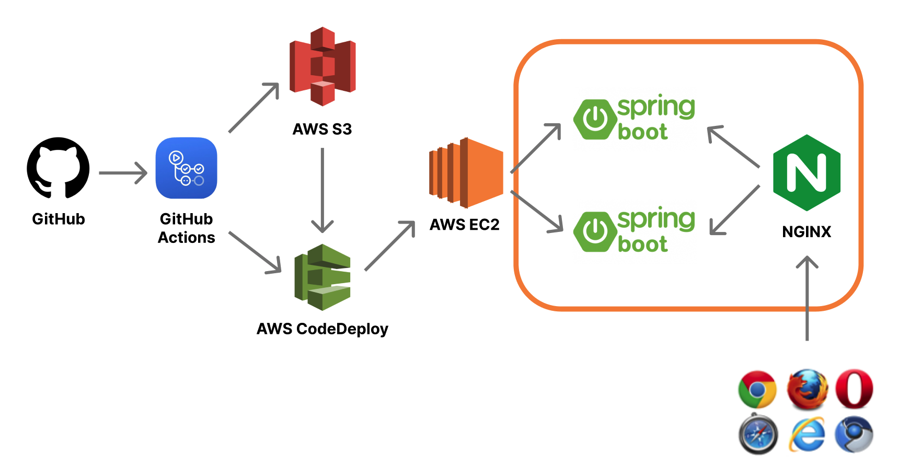

# Heart to Heart API Server
이 프로젝트는 `Heart to Heart` 어플리케이션을 위한 API 서버입니다. `Heart to Heart` 안드로이드 어플리케이션은 [이 곳](https://github.com/yologger/heart-to-heart-android)에서 확인할 수 있습니다.

## Legacy
Nodejs 기반의 레거시 프로젝트의 소스코드는 [이 곳](https://github.com/yologger/heart-to-heart-nodejs)에서 확인할 수 있습니다.

## 기술 스택

### 시스템 아키텍처

### 공통
- Spring Boot
- Spring MVC
- Spring Data JPA
- Spring Security
- Spring Validation
- Spring Mail
- CI/CD pipeline (GitHub Actions/AWS CodeDeploy)
- 무중단배포 (NGINX)

### 테스트 환경
- ~~Heroku SaaS~~ (Deprecated)
- ~~Heroku MySQL~~ (Deprecated)
- AWS EC2
- AWS S3
- AWS RDS (Maria DB)

### 운영 환경
- AWS EC2
- AWS S3
- AWS RDS (Maria DB)

# Todo List
- [x] 회원가입 시 이메일 인증 구현
- [x] `JWT` 기반 `OAuth2` 인증 구현
- [ ] 업로드 이미지 리사이징 (AWS Lambda)
- [x] `Refresh Token`을 통한 토큰 갱신 구현
- [ ] `Gradle 멀티 모듈`기능을 사용하여 `Clean Architecture`로 리팩토링
- [ ] `Domain Layer`를 추가하고 `비즈니스 로직`을 `Service Layer`로부터 분리하여 `Layered Architecuture`로 리팩토링
- [ ] 팔로우, 팔로잉 기능 구현
- [ ] 비밀번호 찾기, 변경 구현
- [ ] 글 삭제 구현
- [x] CI/CD pipeline 구축
- [ ] 깃 브랜치 전략 도입(`git-flow`)
- [x] 테스트 환경 - `Heroku`, `Jaws DB(MySQL)` 환경에서 `AWS EC2`, `AWS RDS(Maria DB)`로 마이그레이션
- [x] 테스트 환경 - `NGINX`를 통한 무중단 배포 구현
- [x] 운영 환경 - `NGINX`를 통한 무중단 배포 구현
- [ ] 운영 환경 - 컨테이너 오케스트레이션를 위해 `Docker`, `Kubernetes` 환경으로 마이그레이션