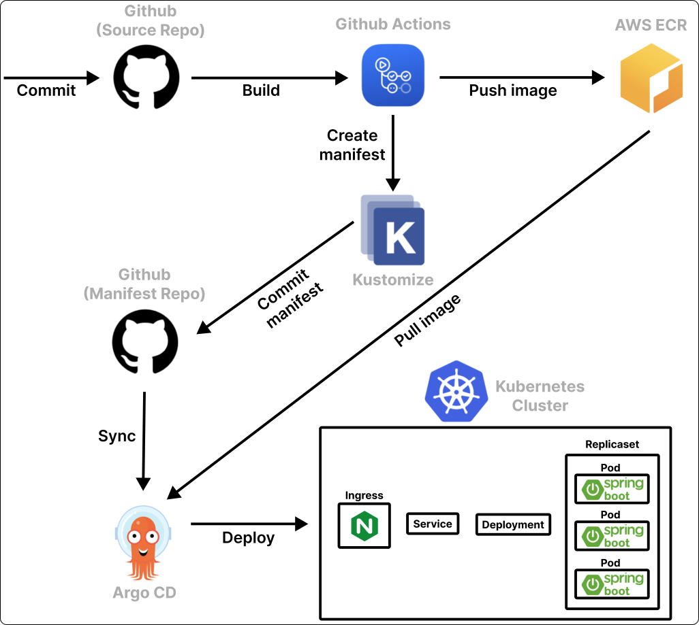

# Heart to Heart API Server
이 프로젝트는 `Heart to Heart` 어플리케이션을 위한 API 서버입니다. `Heart to Heart` 안드로이드 어플리케이션은 [이 곳](https://github.com/yologger/heart-to-heart-android)에서 확인할 수 있습니다.

## 기능 구현
- [x] 이메일 인증 (`Spring Email`)
- [x] 회원 가입
- [x] 토큰 기반 로그인 구현 및 권한 부여 (`JWT`, `Spring Security`)
- [x] 토큰 갱신 구현 (`JWT`, `Spring Security`)
- [x] 로그아웃 구현
- [x] 회원 탈퇴 구현 
- [x] 아바타 이미지 업로드 (`AWS S3`)
- [x] 사용자 차단 및 해제 구현 (`Spring Data JPA`)
- [x] 사용자 신고 구현
- [x] API 입력값 인증 구현 (`Spring Validation`)
- [x] 게시글 작성 구현
- [x] 게시글 조회 구현 (`Query DSL`)
- [x] 게시글 삭제 구현
- [x] `ControllerAdvice`를 통한 에러 처리
- [x] `JUnit 5`, `Truth`, `Assertion`, `Mockito`, `H2`를 사용한 단위테스트, 통합테스트 구현
- [x] `Swagger 2`를 사용한 문서화
- [x] 테스트 환경 구축
  - [x] ~~Heroku, Jaws DB(MySQL)을 통한 테스트 환경 구축~~ (Deprecated)
  - [x] AWS EC2, S3, RDS를 통한 테스트 환경 구축
  - [x] Git/GitHub, GitHub Actions, AWS CodeDeploy, S3를 통한 CI/CD 구축
  - [x] Nginx를 통한 무중단 배포 구축
- [x] 운영 환경 구축
  - [x] Docker, Kubernetes를 통한 운영 환경 구축
  - [x] Kustomize, GitHub, AWS ECR, Argo CD를 통한 Pull-based GitOps 구축
  - [x] Git Flow를 통한 깃 브랜치 전략 도입
  - [x] Kubernetes Replicset을 통한 셀프 힐링 구축
  - [x] Kubernetes Deployment를 통한 무중단 배포, 롤백 기능 구축
  - [x] Kubernetes Service를 통한 로드 밸런싱 구축

## 기술 스택

### 공통
- Spring Boot
- Spring MVC
- Spring Data JPA
- Query DSL
- Spring Security
- Spring Validation
- Spring Mail
- Spring Test
- Lombok
- JUnit 5
- Mockito
- Swagger 2
- AWS EC2
- AWS S3
- AWS S3 Mock
- AWS RDS (Maria DB)

### 테스트 환경
- ~~Heroku SaaS~~ (Deprecated)
- ~~Heroku MySQL~~ (Deprecated)
- GitHub Actions
- AWS S3
- AWS CodeDeploy
- Nginx

### 운영 환경
- GitHub Actions
- Docker
- AWS ECR
- Kustomize
- Kubernetes (Pod, ReplicaSet, Deployment, Service, Ingress)
- Argo CD

## Legacy
Nodejs 기반의 레거시 프로젝트는 [이 곳](https://github.com/yologger/heart-to-heart-nodejs)에서 확인할 수 있습니다.