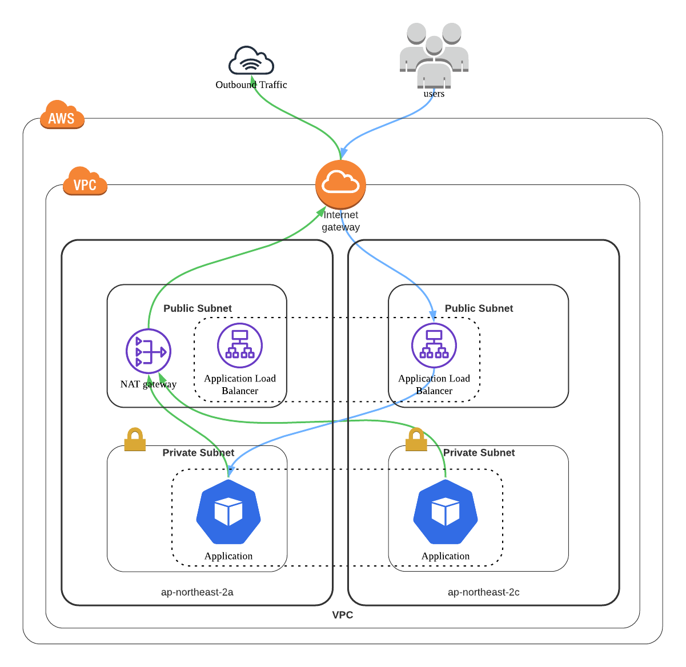

# Heart to Heart API Server
SNS 애플리케이션인 `Heart to Heart`의 API 서버입니다. 안드로이드 어플리케이션은 [이 곳](https://github.com/yologger/heart-to-heart-android)에서 확인할 수 있습니다.

구현 내용은 다음과 같습니다.

## 인증 API 개발
- Gmail 인증 및 회원 가입 구현(`Spring Email`)
- Token 기반 로그인 및 접근 제어 구현(`JWT`, `Spring Security`) 
- Refresh Token을 통한 토큰 갱신 구현
- 로그아웃 구현
- 회원 탈퇴 구현

## 게시글 API 개발
- 게시글 작성, 이미지 업로드 구현(`AWS S3`)
- 게시글 조회, Paging, Sorting 구현(`Spring Data JPA`, `Query DSL`)
- 게시글 삭제 구현
- `Spring Validation`을 통한 입력값 검증
- AOP를 통한 에러 처리 구현 (`ControllerAdvice`)

## TDD
`JUnit 5`, `Truth`, `Assertion`, `Mockito`, `H2`를 사용한 단위테스트, 통합테스트 구현했으며, JACOCO로 테스트 커버리지를 측정하고 있습니다. 자세한 코드는 [이 곳](/src/test/java/com/yologger/heart_to_heart_api)에서 확인할 수 있습니다.


## 문서화
`Swagger 2`를 사용한 문서화를 적용하고 있습니다.


## 인프라 구축

### local 환경
`local` 환경에서는 별도의 데이터베이스 구축 없이도 어플리케이션을 실행할 수 있도록 인메모리 데이터베이스를 사용했습니다.
- H2
- Embedded Redis

### staging 환경
기존에는 SaaS인 `Heroku`를 사용하여 인프라를 구축했습니다.
- ~~Heroku Serverless Computing~~ (Deprecated)
- ~~Heroku MySQL~~ (Deprecated)

무중단 배포 구축을 위해서는 Linux 서버를 직접 제어할 필요가 있었습니다. 이 때문에 IaaS인 AWS EC2로 마이그레이션 했습니다.

또한 다음 기술을 사용하여 CI/CD 자동화를 구축했습니다.
- GitHub Actions
- AWS S3
- AWS CodeDeploy

그 외에도 리버스 프록시 서버로 `Nginx`를 배치하여 무중단 배포를 구축했습니다.


### production 환경
Terraform을 사용하여 AWS VPC, Public Subnet, Private Subnet, Internet Gateway, NAT Gateway, Routing Table 구축을 자동화했습니다. 상세한 스크립트는 [이 곳](/terraform/production/aws_vpc.tf)에서 확인할 수 있습니다.



Kubernetes AWS EKS(NodeGroup) 또한 Terraform으로 자동화했습니다. 상세한 스크립트는 [이 곳](/terraform/production/aws_eks.tf)에서 확인할 수 있습니다.

그 외에도 다음 기능을 구축했습니다.
- Kubernetes ReplicSet을 통한 스케일 아웃, 셀프 힐링 구축
- Kubernetes Deployment를 통한 무중단 배포, 롤백 기능 구축


## 로드 밸런싱 구축
AWS Elastic LoadBalancer(L7, ALB)와 Kubernetes Ingress 연동을 위해 AWS Load Balancer Controller를 사용하여 로드 밸런싱을 구축했습니다.

다음과 같이 AWS Load Balancer Controller가 정상적으로 작동하는 것을 확인할 수 있습니다.
```shell
$ kubectl get all -n kube-system
NAME                                                             READY   STATUS    RESTARTS   AGE
pod/aws-load-balancer-controller-649b9bc59c-fxvfd                1/1     Running   0          67m
pod/aws-load-balancer-controller-649b9bc59c-t6x8f                1/1     Running   0          67m
```

Kubernetes Ingress를 생성하면 AWS Load Balancer가 함께 생성되는 것을 확인할 수 있습니다.


## CI/CD 자동화 구축
- 깃 브랜치 전략 도입 (develop, staging, main)
- GitHub Actions, Helm, AWS ECR, Argo CD를 통한 GitOps 기반 CI/CD 자동화 구축
- Slack 메시징 연동 구축


Pull Request가 GitHub Repository main 브랜치에 병합되면 GitHub Actions가 자동으로 실행됩니다. 


빌드에서 성공하면 먼저 AWS ECR에 Docker Image를 Push 합니다.


그리고 Helm Chart를 업데이트 합니다.


쿠버네티스 클러스터에는 Argocd Server가 실행 중인 것을 확인할 수 있습니다.
``` shell
$ kubectl get svc -n argocd
NAME                               TYPE           CLUSTER-IP       EXTERNAL-IP                                                                   PORT(S)                      AGE
argocd-application-controller      ClusterIP      172.20.22.79     <none>                                                                        8082/TCP                     76m
argocd-applicationset-controller   ClusterIP      172.20.150.239   <none>                                                                        7000/TCP                     76m
argocd-dex-server                  ClusterIP      172.20.47.109    <none>                                                                        5556/TCP,5557/TCP            76m
argocd-redis                       ClusterIP      172.20.26.106    <none>                                                                        6379/TCP                     76m
argocd-repo-server                 ClusterIP      172.20.186.182   <none>                                                                        8081/TCP                     76m
argocd-server                      LoadBalancer   172.20.78.125    ad234b32a27e646bcaacb712a03aee61-609176524.ap-northeast-2.elb.amazonaws.com   80:30144/TCP,443:30856/TCP   76m
```

ArgoCD는 업데이트된 Helm Chart를 읽어 Kuburnetes Cluster에 배포합니다.


```shell
$ kubectl get all
NAME                                      READY   STATUS    RESTARTS   AGE
pod/h2h-api-deployment-78d9844db8-fgxm2   1/1     Running   0          2m6s
pod/h2h-api-deployment-78d9844db8-tbnm4   1/1     Running   0          2m6s

NAME                      TYPE        CLUSTER-IP       EXTERNAL-IP   PORT(S)          AGE
service/h2h-api-service   NodePort    172.20.171.213   <none>        5000:32232/TCP   2m6s
service/kubernetes        ClusterIP   172.20.0.1       <none>        443/TCP          129m

NAME                                 READY   UP-TO-DATE   AVAILABLE   AGE
deployment.apps/h2h-api-deployment   2/2     2            2           2m6s

NAME                                            DESIRED   CURRENT   READY   AGE
replicaset.apps/h2h-api-deployment-78d9844db8   2         2         2       2m6s

NAME                                              REFERENCE                       TARGETS   MINPODS   MAXPODS   REPLICAS   AGE
horizontalpodautoscaler.autoscaling/h2h-api-hpa   Deployment/h2h-api-deployment   2%/70%    1         3         2          2m6s
```

## Auto Scaling 구축

CPU Utilization, Memory Usage, Network Traffic에 따른 오토 스케일링을 구축했습니다.
### HPA
`HPA(Horizontal Pod AutoScaler)`, `Kubernetes Metrics Server`를 통해 팟 오토 스케일링을 구축했습니다.

먼저 HPA에 필요한 Metrics Server를 확인할 수 있습니다.
```shell
$ kubectl get all -n kube-system | grep metrics-server
pod/metrics-server-65dbd5ffff-tfp7m                              1/1     Running   0          124m
service/metrics-server                                       ClusterIP      172.20.66.39    <none>                                                                         443/TCP                        124m
deployment.apps/metrics-server                              1/1     1            1           124m
replicaset.apps/metrics-server-65dbd5ffff                              1         1         1       124m
```
HPA도 잘 작동 중인 것을 확인할 수 있습니다.
```shell
$ kubectl get hpa
NAME          REFERENCE                       TARGETS   MINPODS   MAXPODS   REPLICAS   AGE
h2h-api-hpa   Deployment/h2h-api-deployment   0%/70%    1         20        2          7m10s
```
Apache JMeter로 부하테스트를 진행하면 부하에 따라 팟이 자동으로 스케일 아웃되는 것을 확인할 수 있습니다. 


### CA
팟이 늘어난다고 해도 워커 노드 리소스가 부족하면 결국 워커 노드를 스케일아웃 해야합니다. `Cluster Autoscaler`를 통해 워커 노드 오토 스케일러 또한 구축했습니다.
```shell
$ kubectl get all -n kube-system | grep cluster-autoscaler
pod/cluster-autoscaler-aws-cluster-autoscaler-7cfc8957cb-ww468   1/1     Running   0          136m
service/cluster-autoscaler-aws-cluster-autoscaler            ClusterIP      172.20.61.228   <none>                                                                         8085/TCP                       136m
deployment.apps/cluster-autoscaler-aws-cluster-autoscaler   1/1     1            1           136m
replicaset.apps/cluster-autoscaler-aws-cluster-autoscaler-7cfc8957cb   1         1         1       136m
```

Cluster Autoscaler를 위한 AWS 리소스 설정은 [이 곳](terraform/production/cluster_autoscaler.tf)에서 확인할 수 있습니다.

팟이 늘어나면 워커 노드가 스케일 아웃 됩니다. 


워커 노드에 팟이 재배치되는 것도 확인할 수 있습니다.


## 모니터링 시스템 구축
Prometheus, Grafana로 모니터링 시스템을 구축했습니다.

```shell
$ kubectl get all -n monitoring
NAME                                                         READY   STATUS    RESTARTS   AGE
pod/alertmanager-prometheus-kube-prometheus-alertmanager-0   2/2     Running   1          3h6m
pod/prometheus-grafana-8555bfcc65-snhbx                      3/3     Running   0          3h7m
pod/prometheus-kube-prometheus-operator-56cb6cfb96-kxbmw     1/1     Running   0          3h7m
pod/prometheus-kube-state-metrics-564f699ff9-b5v9x           1/1     Running   0          3h7m
pod/prometheus-prometheus-kube-prometheus-prometheus-0       2/2     Running   0          3h6m
pod/prometheus-prometheus-node-exporter-bp8kc                1/1     Running   0          3h7m
pod/prometheus-prometheus-node-exporter-cqpgw                1/1     Running   0          3h7m

NAME                                              TYPE           CLUSTER-IP       EXTERNAL-IP                                                                    PORT(S)                      AGE
service/alertmanager-operated                     ClusterIP      None             <none>                                                                         9093/TCP,9094/TCP,9094/UDP   3h6m
service/prometheus-grafana                        LoadBalancer   172.20.178.88    ab446f3de79b44e289735aaa0a64df9c-1118664956.ap-northeast-2.elb.amazonaws.com   80:30070/TCP                 3h7m
service/prometheus-kube-prometheus-alertmanager   ClusterIP      172.20.204.157   <none>                                                                         9093/TCP                     3h7m
service/prometheus-kube-prometheus-operator       ClusterIP      172.20.156.204   <none>                                                                         443/TCP                      3h7m
service/prometheus-kube-prometheus-prometheus     ClusterIP      172.20.199.197   <none>                                                                         9090/TCP                     3h7m
service/prometheus-kube-state-metrics             ClusterIP      172.20.46.243    <none>                                                                         8080/TCP                     3h7m
service/prometheus-operated                       ClusterIP      None             <none>                                                                         9090/TCP                     3h6m
service/prometheus-prometheus-node-exporter       ClusterIP      172.20.25.231    <none>                                                                         9100/TCP                     3h7m

NAME                                                 DESIRED   CURRENT   READY   UP-TO-DATE   AVAILABLE   NODE SELECTOR   AGE
daemonset.apps/prometheus-prometheus-node-exporter   2         2         2       2            2           <none>          3h7m

NAME                                                  READY   UP-TO-DATE   AVAILABLE   AGE
deployment.apps/prometheus-grafana                    1/1     1            1           3h7m
deployment.apps/prometheus-kube-prometheus-operator   1/1     1            1           3h7m
deployment.apps/prometheus-kube-state-metrics         1/1     1            1           3h7m

NAME                                                             DESIRED   CURRENT   READY   AGE
replicaset.apps/prometheus-grafana-8555bfcc65                    1         1         1       3h7m
replicaset.apps/prometheus-kube-prometheus-operator-56cb6cfb96   1         1         1       3h7m
replicaset.apps/prometheus-kube-state-metrics-564f699ff9         1         1         1       3h7m

NAME                                                                    READY   AGE
statefulset.apps/alertmanager-prometheus-kube-prometheus-alertmanager   1/1     3h6m
statefulset.apps/prometheus-prometheus-kube-prometheus-prometheus       1/1     3h6m
```

Grafana Dashboard에서 노드의 CPU Utilization, Memory Usage, Network Traffic 등 리소스를 모니터링할 수 있습니다.


팟 모니터링도 가능합니다.


## 진행 중인 작업
- [EFK 스택을 통한 통합 로그 관라 시스템 구축](https://yologger.oopy.io/0a036012-a3cf-4182-8e82-ba7d5a7a05dc)
- [Global Cache 구측으로 API 성능 향상시키기](https://yologger.oopy.io/49f26500-ff33-4250-a632-4ecdfad52595)
- [데이터베이스 다중화로 대용량 트래픽 처리하기](https://yologger.oopy.io/d88b6fa5-2b12-49e5-a2f9-bfe4dcbcc4e2)